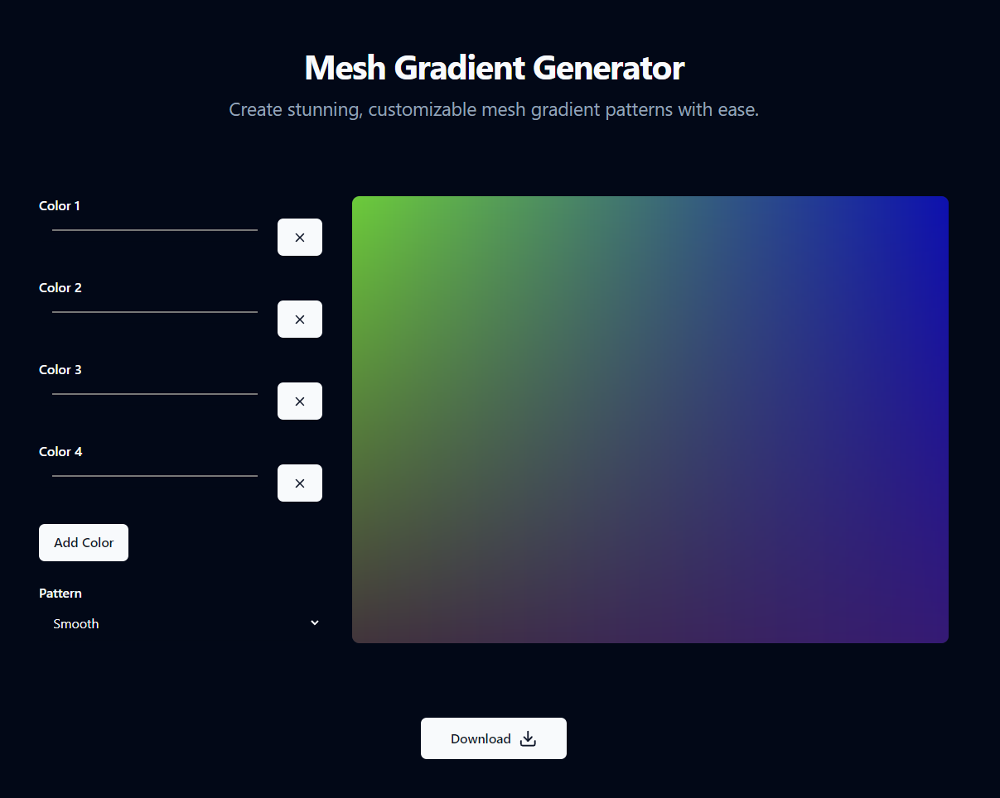

# Mesh Gradient Generator



Create stunning, customizable mesh gradient patterns with ease using this web-based tool.

## Features

- Generate smooth mesh gradients
- Customize with multiple colors
- Choose from various patterns (Smooth, Triangle, Square, Hexagon)
- Download generated gradients as PNG
- Get CSS and Tailwind instructions for recreating the gradient

## Live Demo

[Try the Mesh Gradient Generator](https://quinta0.github.io/meshgradientgen/)

## Getting Started

### Prerequisites

- Node.js (version 14 or later)
- npm or yarn

### Installation

1. Clone the repository:
   ```bash
   git clone https://github.com/Quinta0/meshgradientgen.git
   ```
2. Navigate to the project directory:
    ```bash
    cd meshgradientgen
    ```
3. Install the dependencies:
   ```bash
   npm install
   ```
4. Start the development server:
   ```bash
    npm run dev
    ```
5. Open your browser and visit `http://localhost:3000`

## Contributing

Contributions are welcome! Please feel free to submit a Pull Request.

1. Fork the project
2. Create your feature branch (`git checkout -b feature/AmazingFeature`)
3. Commit your changes (`git commit -m 'Add some AmazingFeature'`)
4. Push to the branch (`git push origin feature/AmazingFeature`)
5. Open a Pull Request

## License

This project is licensed under the MIT License - see the [LICENSE.md](LICENSE.md) file for details.

## Acknowledgments

- [Next.js](https://nextjs.org/) - The React framework used
- [Tailwind CSS](https://tailwindcss.com/) - For styling
- [JSZip](https://stuk.github.io/jszip/) - Used for creating downloadable zip files

